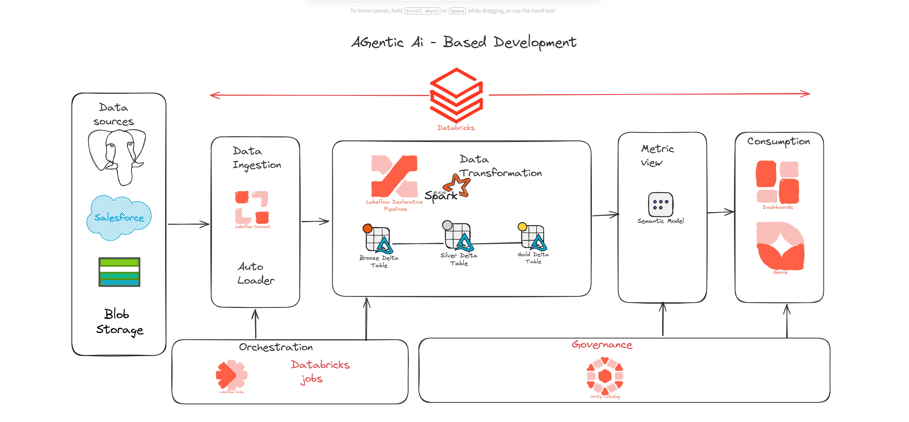

# RetailIQ – End-to-End Retail Analytics Pipeline

## Overview

RetailIQ is an end-to-end Data Engineering project built to simulate how retail companies process data from multiple business systems.

The project brings together data from PostgreSQL, Salesforce, and Azure Blob Storage, processes it using Azure Databricks and PySpark, applies the Medallion Architecture (Bronze → Silver → Gold), and exposes business-ready datasets for reporting in Power BI.

The goal of this project was not only to build an ETL pipeline but also to organize the project like a production repository with a clear folder structure, reusable code, documentation, and architecture.

---

## Architecture


---

## Business Problem

Retail companies often receive data from multiple systems such as transactional databases, CRM platforms, and flat files.

Since this data comes in different formats and structures, it cannot be used directly for reporting.

This project demonstrates how these datasets can be consolidated, cleaned, transformed, and converted into analytical datasets that support business reporting and decision-making.

---

## Data Sources

The project uses three different data sources.

- PostgreSQL
  - Product History
  - Inventory History

- Salesforce
  - Customer Accounts
  - Sales Opportunities

- Azure Blob Storage
  - Historical Transactions
  - Incremental Transaction Files

---

## Solution Approach

The pipeline follows the Medallion Architecture.

### Bronze Layer

The Bronze layer stores raw data exactly as it is received from the source systems.

Typical activities include:

- Loading source files
- Preserving historical records
- Schema evolution
- Raw Delta tables

---

### Silver Layer

The Silver layer is responsible for preparing clean and standardized datasets.

Transformations include:

- Removing duplicate records
- Handling missing values
- Standardizing data types
- Applying business rules
- Creating consistent datasets

---

### Gold Layer

The Gold layer contains business-ready tables used for reporting and analytics.

Examples include:

- Fact Sales
- Product Metrics
- Customer Metrics
- Calendar View
- Business KPIs

---

## Folder Structure

```
01_RetailIQ_Project
│
├── 01_Source_Data
│   ├── PostgreSQL
│   ├── Salesforce
│   └── Blob Storage Files
│
├── 02_Notebooks
│   ├── Bronze Load
│   ├── Gold Views
│   ├── Calendar
│   └── Metric Views
│
├── 03_ETL_Pipeline
│   ├── Bronze to Silver
│   └── Silver to Gold
│
├── 04_Dashboard
│
├── 05_Project_Architecture
│
└── README.md
```

---

## Dashboard

The final Power BI dashboard provides insights such as:

- Total Revenue
- Average Transaction Value
- Revenue Trend
- Revenue by Product Category
- Revenue by Sales Channel
- Revenue by Payment Method
- Total Quantity Sold
- Customer Analysis

*(Dashboard screenshot can be added here.)*



---

## Technologies Used

- Azure Databricks
- PySpark
- Apache Spark
- Delta Lake
- SQL
- PostgreSQL
- Salesforce
- Azure Blob Storage
- Power BI
- Git & GitHub

---

## What I Learned

Working on this project helped me understand how an end-to-end data pipeline is designed and organized.

Some of the key concepts I practiced include:

- Designing ETL pipelines
- Implementing the Medallion Architecture
- Writing PySpark transformations
- Working with Delta tables
- Building analytical views using SQL
- Organizing a production-style repository
- Creating business dashboards

---

## Possible Improvements

Some enhancements I plan to add in future versions include:

- Azure Data Factory for orchestration
- Delta Live Tables
- Unity Catalog
- CI/CD pipeline
- Streaming data ingestion
- Automated data quality validation

---

## Author

**Varun Kumar**

If you'd like to discuss the project or have suggestions for improvements, feel free to connect with me on GitHub.

GitHub: https://github.com/varunkumar021997-del